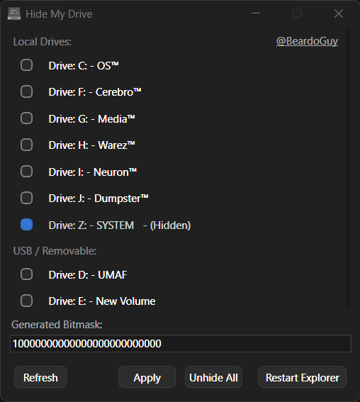

# HideMyDrive
Hide Windows 10 / Windows 11 System Drives like (Z:/, SYSTEM, EFI, RECOVERY) and other drives from showing up in Windows Explorer (Computer) without actually deleting them. 
## Screenshot:  
  
  
## Purpose:  
-Mainly to hide the annoying System drives like the RECOVERY or SYSTEM, and others which are not even accessible by the user, but end up showing in the Windows Explorer by some bug. I tried the regular "Manage" -> "Disk Management" and other tweaks to hide them, but they didn't work on my system, so I made this tiny utility.  
-It works by masking the specific Drive letter-related binary bits inside the Current User Registry in Windows, so it's completely safe to use.  
-It only hides the drives from showing up in the Windows Explorer and won't actually remove or delete them.  
-The Hidden drives will continue to work as usual.
-Can be used to hide any other drives, just to keep your Windows Explorer tidy.
## Usage:  
1. Just mark the checkboxes in front of the Drive Letters/Names that you want to hide  
2. Click on "Apply"  
3. Click on "Restart Explorer" to restart the Windows Explorer.exe  
Done!
